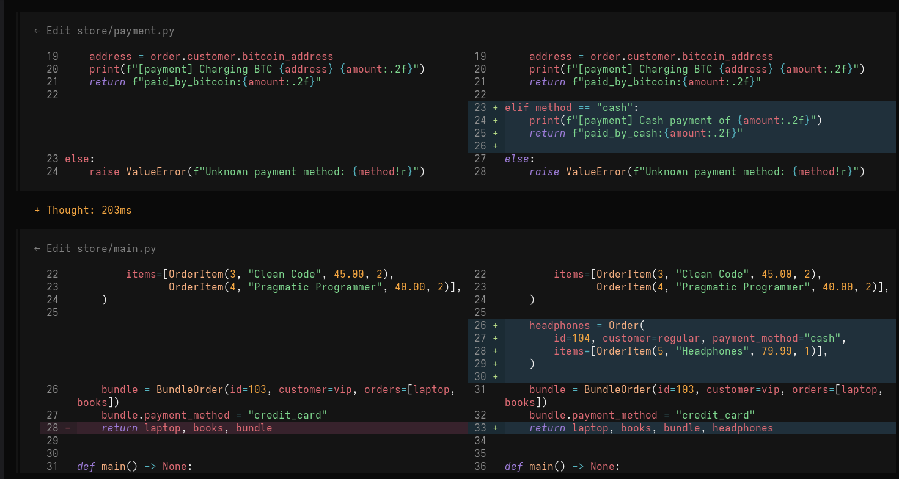
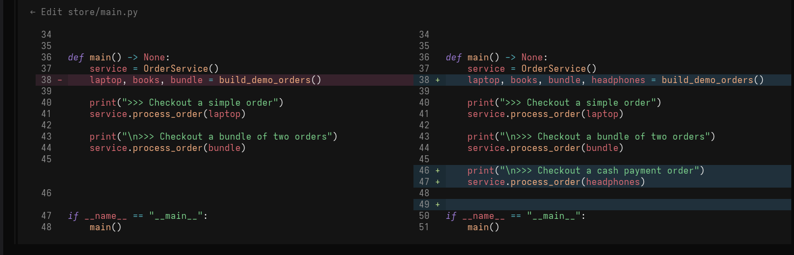
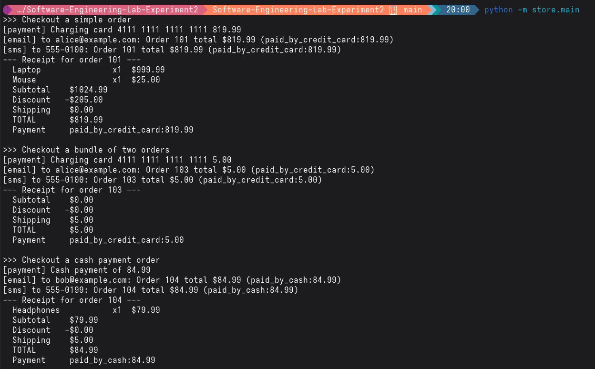
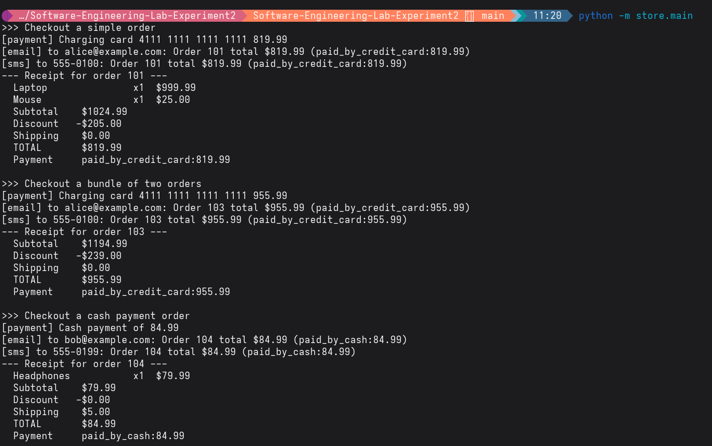

# گزارش آزمایش دوم:

<h2 dir="rtl">آشنایی اولیه با OpenCode</h2>

<h3 dir="rtl">۱. نحوه نصب و راه‌اندازی OpenCode در Arch Linux و Windows</h3>

<p dir="rtl">ابزار OpenCode یک <strong>AI coding agent متن‌باز</strong> است که می‌توان از طریق ترمینال برنامه دسکتاپ یا افزونه IDE از آن استفاده کرد. برای استفاده از آن ابتدا باید خود OpenCode نصب شده و سپس یک ارائه‌دهنده مدل زبانی (LLM Provider) برای آن تنظیم شود.</p>

<h3 dir="rtl">Arch Linux</h3>

<p dir="rtl">در <strong>Arch Linux</strong> می‌توان OpenCode را از مخازن رسمی با دستور زیر نصب کرد:</p>

```bash
sudo pacman -S opencode
```

<p dir="rtl">همچنین نسخه موجود در AUR نیز قابل نصب است:</p>

```bash
paru -S opencode-bin
```

<h3 dir="rtl">Windows</h3>

<p dir="rtl">برای <strong>Windows</strong> مستندات OpenCode استفاده از <strong>WSL</strong> را برای تجربه بهتر پیشنهاد می‌کنند. همچنین روش‌هایی مانند Chocolatey، Scoop، npm، Docker یا دریافت فایل اجرایی نیز وجود دارد.</p>

<p dir="rtl">برای مثال با npm می‌توان از دستور زیر استفاده کرد:</p>

```bash
npm install -g opencode-ai
```

<p dir="rtl">پس از نصب، با اجرای دستور زیر OpenCode در پروژه موردنظر اجرا می‌شود:</p>

```bash
opencode
```

---

<h2 dir="rtl">۲. نحوه اتصال مدل‌های زبانی و تنظیمات اولیه</h2>

<p dir="rtl">خود OpenCode یک مدل زبانی خاص نیست بلکه به عنوان یک Agent می‌تواند به <strong>ارائه‌دهندگان مختلف مدل‌های زبانی</strong> متصل شود. بنابراین پس از نصب باید یک Provider و مدل مناسب انتخاب شود.</p>

<p dir="rtl">اتصال مدل را می‌توان مستقیما از داخل محیط OpenCode و با دستور <code dir="ltr">/connect</code> انجام داد. در این مرحله Provider موردنظر انتخاب شده و اطلاعات احراز هویت مانند API Key وارد می‌شود.</p>

<p dir="rtl">همچنین OpenCode سرویس <strong>OpenCode Zen</strong> را به عنوان مجموعه‌ای از مدل‌های تست‌شده پیشنهاد می‌کند. که ما در اینجا از مدل رایگان پیشنهادی آن یعنی Big Pickle استفاده کردیم.</p>

<p dir="rtl">پس از اتصال Provider، می‌توان مدل موردنظر را برای Agent انتخاب کرد و سپس پروژه را در اختیار OpenCode قرار داد.</p>

<p dir="rtl">برای تنظیم اولیه پروژه نیز می‌توان از دستور <code dir="ltr">/init</code> استفاده کرد. این دستور ساختار پروژه را بررسی کرده و یک فایل <code dir="ltr">AGENTS.md</code> در ریشه پروژه ایجاد یا به‌روزرسانی می‌کند.</p>

---

<h2 dir="rtl">۳. فایل <code dir="ltr">AGENTS.md</code> و نقش آن در Context</h2>

<p dir="rtl">فایل <code dir="ltr">AGENTS.md</code> برای قرار دادن <strong>دستورالعمل‌های اختصاصی پروژه</strong> در اختیار OpenCode استفاده می‌شود. این فایل باعث می‌شود Agent اطلاعات مهم پروژه را در تعاملات خود در نظر بگیرد.</p>

<p dir="rtl">برای مثال می‌توان در این فایل موارد زیر را مشخص کرد:</p>

<ul dir="rtl">
<li>ساختار کلی پروژه</li>
<li>نحوه اجرای پروژه</li>
<li>دستورات Build، Test و Lint</li>
<li>استانداردهای کدنویسی</li>
<li>معماری پروژه</li>
<li>نکات مهم مربوط به تنظیمات پروژه</li>
<li>محدودیت‌ها یا قواعدی که Agent باید هنگام تغییر کد رعایت کند</li>
</ul>

<p dir="rtl">پس OpenCode این دستورالعمل‌ها را در Context مدل قرار می‌دهد تا Agent هنگام تحلیل و انجام وظایف، آن‌ها را در نظر بگیرد.</p>

<p dir="rtl">دستور <code dir="ltr">/init</code> نیز می‌تواند با بررسی پروژه، یک <code dir="ltr">AGENTS.md</code> اولیه ایجاد کند. توصیه مستندات OpenCode این است که این فایل در Git پروژه نیز نگهداری شود.</p>

<p dir="rtl">بنابراین <code dir="ltr">AGENTS.md</code> را می‌توان مانند <strong>راهنمای پروژه برای Agent</strong> در نظر گرفت.</p>

---

<h2 dir="rtl">۴. مفهوم Agent و نحوه استفاده از آن</h2>

<p dir="rtl">در OpenCode، <strong>Agent یک دستیار هوش مصنوعی تخصصی برای انجام وظایف نرم‌افزاری</strong> است که می‌تواند به ابزارهای مختلفی مانند خواندن و ویرایش فایل‌ها، اجرای دستورات و بررسی پروژه دسترسی داشته باشد.</p>

<p dir="rtl">Agentها می‌توانند برای وظایف و Workflowهای متفاوت تنظیم شوند.</p>

<p dir="rtl">OpenCode به‌طور پیش‌فرض Agentهای مختلفی دارد. دو Agent اصلی آن عبارت‌اند از:</p>

<ul dir="rtl">
<li><strong>Build:</strong> برای انجام کارهای توسعه و اعمال تغییرات در پروژه استفاده می‌شود و دسترسی گسترده‌ای به ابزارهای لازم برای تغییر فایل‌ها و اجرای دستورات دارد.</li>
<li><strong>Plan:</strong> برای تحلیل و برنامه‌ریزی استفاده می‌شود و به‌صورت پیش‌فرض دسترسی‌های محدودتری برای جلوگیری از ایجاد تغییرات ناخواسته دارد.</li>
</ul>

<p dir="rtl">همچنین OpenCode دارای Subagentهایی مانند <code dir="ltr">General</code>، <code dir="ltr">Explore</code> و <code dir="ltr">Scout</code> است که می‌توانند برای وظایف تخصصی‌تر توسط Agent اصلی مورد استفاده قرار گیرند.</p>

---

<h2 dir="rtl">۵. مفهوم Skill و کاربرد آن</h2>

<p dir="rtl">مفهوم <strong>Skill</strong> مجموعه‌ای از دستورالعمل‌های قابل استفاده مجدد است که یک رفتار یا Workflow مشخص را به Agent آموزش می‌دهد.</p>

<p dir="rtl">Skill معمولا در قالب یک فایل <code dir="ltr">SKILL.md</code> تعریف می‌شود. برای مثال ساختار یک Skill می‌تواند به شکل زیر باشد:</p>

```text
.opencode/
└── skills/
    └── code-review/
        └── SKILL.md
```

<p dir="rtl">در فایل <code dir="ltr">SKILL.md</code> می‌توان دستورالعمل‌های مربوط به آن Skill را قرار داد. OpenCode Skillهای موجود را شناسایی می‌کند و در صورت نیاز، Agent می‌تواند آن‌ها را به‌صورت <strong>on-demand</strong> بارگذاری کند.</p>

<p dir="rtl">بنابراین تفاوت کلی آن با <code dir="ltr">AGENTS.md</code> این است که:</p>

<ul dir="rtl">
<li><code dir="ltr">AGENTS.md</code> بیشتر برای <strong>قواعد و اطلاعات کلی مربوط به یک پروژه</strong> است.</li>
<li><strong>Skill</strong> برای <strong>رفتارها و قابلیت‌های قابل استفاده مجدد و تخصصی</strong> طراحی شده است.</li>
</ul>

<p dir="rtl">برای مثال می‌توان Skill مربوط به موارد زیر ایجاد کرد:</p>

<ul dir="rtl">
<li>Code Review</li>
<li>تولید Release Notes</li>
<li>اجرای یک Workflow خاص توسعه</li>
<li>انجام یک فرایند استاندارد در پروژه</li>
</ul>

---

<h2 dir="rtl">۶. حالت‌های Plan و Build</h2>

<p dir="rtl">در OpenCode دو Agent اصلی با نام‌های <strong>Plan</strong> و <strong>Build</strong> دارد که هدف متفاوتی دارند.</p>

<h3 dir="rtl">Plan</h3>

<p dir="rtl">حالت <strong>Plan</strong> برای <strong>تحلیل، بررسی و برنامه‌ریزی</strong> مناسب است.</p>

<p dir="rtl">در این حالت Agent قبل از ایجاد تغییرات، ساختار پروژه و مشکل موردنظر را بررسی کرده و راهکار پیشنهادی ارائه می‌دهد.</p>

<p dir="rtl">به‌صورت پیش‌فرض، عملیات‌هایی مانند ویرایش فایل‌ها و اجرای دستورات Bash در این حالت محدود شده‌اند یا نیاز به تأیید دارند.</p>

<p dir="rtl">به همین دلیل Plan برای زمانی مناسب است که ابتدا می‌خواهیم بفهمیم <strong>چه تغییراتی باید انجام شوند</strong> بدون اینکه Agent مستقیما آن‌ها را اعمال کند.</p>

<h3 dir="rtl">Build</h3>

<p dir="rtl">حالت <strong>Build</strong> برای مرحله اجرای تغییرات استفاده می‌شود.</p>

<p dir="rtl">این Agent دسترسی بیشتری به ابزارهای توسعه دارد و می‌تواند فایل‌ها را تغییر دهد و دستورات لازم را اجرا کند.</p>

<p dir="rtl">بنابراین می‌توان Workflow زیر را در نظر گرفت:</p>

```text
Problem
   ↓
Plan
   ↓
Analyze + Design Solution
   ↓
Review the Proposed Plan
   ↓
Build
   ↓
Implement Changes
   ↓
Test + Verify
```

<p dir="rtl">این تفکیک باعث می‌شود ابتدا راهکار بررسی شود و سپس تغییرات در پروژه اعمال شوند.</p>

---

<h2 dir="rtl">۷. نحوه نوشتن Prompt مناسب برای Agent</h2>

<p dir="rtl">برای گرفتن نتیجه مناسب از Agent، Prompt باید <strong>واضح، دقیق و دارای Context کافی</strong> باشد.</p>

<p dir="rtl">به جای دستورهای بسیار کلی مانند:</p>

```text
Fix my project.
```

<p dir="rtl">بهتر است مسئله، محل مشکل، هدف و محدودیت‌های موردنظر مشخص شوند.</p>

<p dir="rtl">برای مثال:</p>

```text
Analyze the authentication flow in this project.
First identify the files and components involved.
Do not modify any files yet.
Explain the current flow and identify potential problems.
Then propose a solution and wait for my approval before making changes.
```

<p dir="rtl">یک Prompt مناسب معمولا شامل این موارد است:</p>

<ol dir="rtl">
<li><strong>هدف:</strong> دقیقا چه کاری باید انجام شود؟</li>
<li><strong>Context:</strong> مشکل مربوط به کدام قسمت پروژه است؟</li>
<li><strong>محدودیت‌ها:</strong> Agent چه کارهایی را نباید انجام دهد؟</li>
<li><strong>مراحل مورد انتظار:</strong> ابتدا تحلیل کند، سپس پیشنهاد دهد و بعد تغییرات را اعمال کند.</li>
<li><strong>معیار نتیجه:</strong> چگونه می‌توان تشخیص داد که کار درست انجام شده است؟</li>
</ol>

<p dir="rtl">همچنین بهتر است وظایف بزرگ به چند مرحله کوچک‌تر تقسیم شوند.</p>

<p dir="rtl">برای مثال ابتدا از Agent خواسته شود پروژه را <strong>تحلیل</strong> کند، سپس یک <strong>Plan</strong> ارائه دهد، بعد از بررسی Plan اجازه <strong>Build</strong> داده شود و در پایان نیز تست‌ها و نتیجه تغییرات بررسی شوند.</p>

<p dir="rtl">این روش با هدف آزمایش نیز هماهنگ است، زیرا در این فرآیند Agent صرفا جایگزین دانشجو نمی‌شود، بلکه خروجی آن باید توسط دانشجو <strong>بررسی، ارزیابی و در صورت نیاز اصلاح یا رد</strong> شود.</p>

---

<h2 dir="rtl">انجام آزمایش</h2>

<h3 dir="rtl">گام اول: افزودن یک قابلیت جدید به نسخه اولیه</h3>

<p dir="rtl">در نسخه فعلی روش پرداخت‌ها credit_card، paypal، bitcoin هستند:</p>

<p dir="rtl">ابتدا با دادن پرامپت زیر به opencode خروجی agent را بررسی می‌کنیم.</p>

```text
We need to add a new payment method to the existing project:

Payment method: cash

This is the FIRST implementation of the feature, before any SOLID refactoring.

IMPORTANT CONSTRAINTS:

1. Do NOT refactor the existing architecture.
2. Do NOT fix SOLID violations.
3. Do NOT introduce payment interfaces or strategy patterns.
4. Keep the existing design as much as possible.
5. Implement Cash Payment consistently with the existing payment methods.

Before changing anything:

1. Identify every file/class/method that needs to be changed.
2. Explain why each change is necessary.
3. Identify whether any existing tests or demo code need to be updated.
4. Estimate the scope of the changes.

Then STOP and wait for my approval.

Do not modify any files yet.
```

<p dir="rtl">چون خروجی کد همچنان درست است تغییرات را با پرامپت زیر روی کد اعمال می‌کنیم.</p>

```text
The proposed changes are approved.

Plese implement exactly the proposed changes:

1. Add the cash payment branch to payment.py.
2. Add a cash demo order to main.py so the new payment method can be tested.

Do not refactor anything.
Do not modify any other files.
Do not introduce new classes or abstractions.

After making the changes:
1. show me the diff.
2. Run the project.
3. Verify that the cash payment path works.
4. Report the test result.
```

| ردیف | کلاس یا فایل | نوع تغییر | توضیح تغییر                                                                                     |
| ---: | ------------ | --------- | ----------------------------------------------------------------------------------------------- |
|    1 | payment.py   | add       | یک شاخه شرطی جدید برای cash به متد PaymentProcessor.process اضافه شد تا پرداخت نقدی پردازش شود. |
|    2 | main.py      | modify    | یک سفارش نمونه با روش پرداخت نقدی اضافه شد تا قابلیت جدید قابل اجرا و آزمایش باشد.              |





<h3 dir="rtl">گام دوم: تحلیل اصول طراحی</h3>

<p dir="rtl">در ابتدا با استفاده از هر دو gpt و opencode و بررسی کد اصول طراحی کاملا بررسی شده است تا چیزی از قلم نیفتد. نتیجه نهایی:</p>

| اصل     | رعایت شده؟ | محل در پروژه                                                     | توضیح                                                                                                                                                                                                                                                                                          |
| ------- | ---------- | ---------------------------------------------------------------- | ---------------------------------------------------------------------------------------------------------------------------------------------------------------------------------------------------------------------------------------------------------------------------------------------- |
| **SRP** | خیر        | `store/order_service.py` — `OrderService`                        | مسئولیت‌های مختلف `OrderService` از یکدیگر جدا شده‌اند. اعتبارسنجی در `validate_order`، محاسبه قیمت در `PricingEngine` و چاپ رسید در `ReceiptPrinter` انجام می‌شود. `OrderService` عمدتاً وظیفه هماهنگ‌سازی فرایند ثبت سفارش را بر عهده دارد.                                                  |
| **OCP** | خیر        | `store/payment.py` — `PaymentProcessor`                          | روش‌های پرداخت با الگوی Strategy پیاده‌سازی شده‌اند. هر روش پرداخت مانند `CreditCardPayment`، `PaypalPayment`، `BitcoinPayment` و `CashPayment` یک پیاده‌سازی مستقل از `PaymentStrategy` است. بنابراین برای افزودن روش پرداخت جدید، منطق اصلی `PaymentProcessor.process` نیازی به تغییر ندارد. |
| **OCP** | خیر        | `store/pricing.py` — `DiscountCalculator`                        | قوانین تخفیف از `DiscountCalculator` جدا شده‌اند و هر قانون در کلاس مستقلی مانند `VipDiscount`، `BulkDiscount` و `CouponDiscount` قرار دارد. افزودن قانون تخفیف جدید با ایجاد یک کلاس جدید امکان‌پذیر است و نیازی به تغییر منطق `DiscountCalculator` نیست.                                     |
| **LSP** | خیر        | `store/notification.py` و `store/models.py`                      | مشکل `SmsOnlyNotifier` با حذف inheritance نامناسب و جداسازی interfaceهای notification برطرف شده است. همچنین `BundleOrder` رفتارهای `subtotal` و `item_count` را به‌درستی بر اساس سفارش‌های داخلی خود محاسبه می‌کند و دیگر رفتار ناسازگاری با `Order` ندارد.                                    |
| **ISP** | خیر        | `store/protocols.py` — `EmailSender`، `SmsSender` و `PushSender` | interface بزرگ `NotificationService` به interfaceهای کوچک‌تر و تخصصی تقسیم شده است. هر client فقط به قابلیت موردنیاز خود وابسته است؛ برای مثال `OrderService` فقط به `EmailSender` و `SmsSender` وابسته است و نیازی به `PushSender` ندارد.                                                     |
| **DIP** | خیر        | `store/order_service.py`                                         | وابستگی‌های `OrderService` از طریق constructor دریافت می‌شوند و برای آن‌ها abstractionهایی مانند `EmailSender`، `SmsSender` و `OrderStorage` تعریف شده است. بنابراین امکان جایگزینی implementationها و استفاده از mock در تست وجود دارد.                                                       |

<h4 dir="rtl">SRP</h4>

<p dir="rtl"><strong>علت نقض:</strong><br>
در نسخه اولیه، OrderService.process_order چند مسئولیت مختلف شامل validation، pricing، payment، persistence، notification و receipt printing را به‌صورت مستقیم انجام می‌داد.</p>

<p dir="rtl"><strong>روش اصلاح:</strong><br>
مسئولیت‌ها از OrderService جدا شدند:</p>

<ul dir="rtl">
<li>validate_order برای اعتبارسنجی</li>
<li>PricingEngine برای محاسبه قیمت</li>
<li>DiscountCalculator برای محاسبه تخفیف</li>
<li>ReceiptPrinter برای چاپ رسید</li>
<li>senderهای جداگانه برای notification</li>
<li>PaymentProcessor برای پرداخت</li>
<li>MySqlDatabase برای ذخیره‌سازی</li>
</ul>

<p dir="rtl"><strong>دلیل انتخاب این راهکار:</strong><br>
با تفکیک مسئولیت‌ها، هر بخش تنها یک وظیفه مشخص دارد و تغییر در یک بخش، تأثیر کمتری بر سایر بخش‌ها خواهد داشت. همچنین تست و نگهداری کد ساده‌تر می‌شود.</p>

<h4 dir="rtl">OCP — Payment</h4>

<p dir="rtl"><strong>علت نقض:</strong><br>
در نسخه اولیه، PaymentProcessor برای انتخاب روش پرداخت از زنجیره‌ای از if/elif استفاده می‌کرد. بنابراین اضافه کردن روش جدیدی مانند cash نیازمند تغییر کد موجود بود.</p>

<p dir="rtl"><strong>روش اصلاح:</strong><br>
برای هر روش پرداخت یک Strategy مستقل ایجاد شد:</p>

```text
PaymentStrategy
├── CreditCardPayment
├── PaypalPayment
├── BitcoinPayment
└── CashPayment
```

<p dir="rtl">و PaymentProcessor با استفاده از یک dictionary، Strategy مناسب را انتخاب می‌کند.</p>

<p dir="rtl"><strong>دلیل انتخاب این راهکار:</strong><br>
روش‌های پرداخت از یکدیگر مستقل می‌شوند و برای افزودن روش جدید کافی است implementation جدیدی از PaymentStrategy اضافه شود؛ بنابراین کد موجود کمتر تغییر می‌کند.</p>

<h4 dir="rtl">OCP — Discount</h4>

<p dir="rtl"><strong>علت نقض:</strong><br>
در نسخه اولیه، قوانین تخفیف در یک زنجیره if/elif داخل DiscountCalculator.calculate قرار داشتند. اضافه کردن قانون جدید نیازمند تغییر این متد بود.</p>

<p dir="rtl"><strong>روش اصلاح:</strong><br>
قوانین تخفیف به کلاس‌های مستقل تبدیل شدند:</p>

```text
DiscountRule
├── VipDiscount
├── BulkDiscount
└── CouponDiscount
```

<p dir="rtl">DiscountCalculator نیز مجموعه‌ای از این ruleها را دریافت کرده و rule مناسب را اجرا می‌کند.</p>

<p dir="rtl"><strong>دلیل انتخاب این راهکار:</strong><br>
قوانین تخفیف از منطق اصلی calculator جدا می‌شوند و افزودن یک قانون جدید بدون تغییر قوانین قبلی امکان‌پذیر می‌شود.</p>

<h4 dir="rtl">LSP</h4>

<p dir="rtl"><strong>علت نقض:</strong><br>
در نسخه اولیه، SmsOnlyNotifier از NotificationService ارث‌بری می‌کرد، اما متدهای send_email و send_push را با NotImplementedError رد می‌کرد. همچنین BundleOrder به دلیل items=[] مقدار subtotal و item_count نادرستی داشت.</p>

<p dir="rtl"><strong>روش اصلاح:</strong><br>
برای notification، interfaceهای مستقل EmailSender، SmsSender و PushSender ایجاد شدند و SmsOnlyNotifier دیگر مجبور به پیاده‌سازی قابلیت‌هایی که پشتیبانی نمی‌کند نیست.</p>

<p dir="rtl">همچنین BundleOrder، متدهای subtotal و item_count را override می‌کند و مقادیر را از سفارش‌های داخلی خود محاسبه می‌کند.</p>

<p dir="rtl"><strong>دلیل انتخاب این راهکار:</strong><br>
هر subtype باید بتواند بدون ایجاد رفتار نادرست جایگزین type والد شود. این اصلاح باعث می‌شود BundleOrder رفتار معناداری به‌عنوان یک Order داشته باشد و notificationها نیز فقط قابلیت‌های واقعی خود را ارائه کنند.</p>

<h4 dir="rtl">ISP</h4>

<p dir="rtl"><strong>علت نقض:</strong><br>
در نسخه اولیه، NotificationService شامل سه متد send_email، send_sms و send_push بود. در نتیجه clientهایی که فقط به یکی از این قابلیت‌ها نیاز داشتند، به کل interface وابسته بودند.</p>

<p dir="rtl"><strong>روش اصلاح:</strong><br>
interface بزرگ به سه interface کوچک تقسیم شد:</p>

<p dir="rtl">EmailSender<br>
SmsSender<br>
PushSender</p>

<p dir="rtl">برای مثال OrderService فقط EmailSender و SmsSender را دریافت می‌کند.</p>

<p dir="rtl"><strong>دلیل انتخاب این راهکار:</strong><br>
هر client فقط به متدهایی وابسته می‌شود که واقعاً استفاده می‌کند. این کار coupling را کاهش داده و از ایجاد کلاس‌هایی مانند SmsOnlyNotifier که مجبور به رد کردن متدهای اضافی هستند جلوگیری می‌کند.</p>

<h4 dir="rtl">DIP</h4>

<p dir="rtl"><strong>علت نقض:</strong><br>
در نسخه اولیه، OrderService مستقیماً به implementationهای concrete مانند DiscountCalculator، PaymentProcessor، NotificationService و MySqlDatabase وابسته بود و آن‌ها را در constructor ایجاد می‌کرد.</p>

<p dir="rtl"><strong>روش اصلاح:</strong><br>
برای dependencyها abstractionهایی مانند موارد زیر تعریف شدند:</p>

<p dir="rtl">PaymentStrategy<br>
DiscountRule<br>
EmailSender<br>
SmsSender<br>
OrderStorage</p>

<p dir="rtl">و dependencyها از طریق constructor به OrderService تزریق می‌شوند.</p>

<p dir="rtl"><strong>دلیل انتخاب این راهکار:</strong><br>
OrderService به جای وابستگی مستقیم به implementation، می‌تواند به abstraction وابسته باشد. در نتیجه implementationها قابل تعویض هستند و برای تست نیز می‌توان mock یا implementation دیگری به OrderService تزریق کرد.</p>

<h3 dir="rtl">گام سوم: طراحی Skill</h3>

<h3 dir="rtl">هدف Skill</h3>

<p dir="rtl">هدف از طراحی این Skill، ایجاد یک دستورالعمل مشخص برای Agent به‌منظور <strong>تحلیل خودکار پروژه از نظر رعایت اصول SOLID</strong> و ارائه پیشنهادهای قابل‌استفاده برای Refactoring است.</p>

<p dir="rtl">Agent با استفاده از این Skill می‌تواند کد پروژه را بررسی کرده و برای هر یک از پنج اصل SOLID شامل <strong>SRP، OCP، LSP، ISP و DIP</strong> موارد زیر را مشخص کند:</p>

<ol dir="rtl">
<li>تشخیص اینکه اصل موردنظر رعایت شده، نقض شده یا احتمال نقض وجود دارد؛</li>
<li>مشخص کردن دقیق محل مشکل در پروژه، شامل نام فایل، کلاس و در صورت امکان شماره خطوط؛</li>
<li>ارائه شواهد و توضیح فنی برای اثبات وجود یا عدم وجود نقض؛</li>
<li>تعیین شدت یا اهمیت نقض؛</li>
<li>پیشنهاد یک روش مناسب برای Refactoring؛</li>
<li>توضیح اینکه چرا روش پیشنهادی برای اصلاح آن مشکل مناسب است؛</li>
<li>در صورت تأیید کاربر، اعمال تغییرات پیشنهادی در کد.</li>
</ol>

<p dir="rtl">بنابراین Skill صرفاً یک ابزار برای پیدا کردن خطاهای طراحی نیست، بلکه یک چارچوب تصمیم‌گیری در اختیار Agent قرار می‌دهد تا <strong>از شناسایی مشکل تا پیشنهاد راه‌حل و در نهایت اعمال Refactoring</strong> را به‌صورت کنترل‌شده انجام دهد.</p>

---

<h3 dir="rtl">اطلاعاتی که Skill در اختیار Agent قرار می‌دهد</h3>

<p dir="rtl">میتوانید فایل skill.md را در مسیر .opencode/skills مشاهده کنید</p>

<p dir="rtl">Skill طراحی‌شده، Agent را با معیارهای مشخصی برای ارزیابی اصول SOLID آشنا می‌کند. برای هر اصل، تعریف اصل، نشانه‌های رایج نقض، روش تحلیل و الگوی مناسب برای اصلاح در اختیار Agent قرار می‌گیرد.</p>

<h4 dir="rtl">SRP — Single Responsibility Principle</h4>

<p dir="rtl">Agent بررسی می‌کند که آیا یک کلاس یا متد بیش از یک مسئولیت مستقل دارد یا خیر. برای مثال، اگر یک متد هم‌زمان وظیفه اعتبارسنجی، محاسبه قیمت، پرداخت، ذخیره اطلاعات، ارسال اعلان و چاپ رسید را انجام دهد، Skill آن را به‌عنوان یک کاندیدای جدی برای نقض SRP شناسایی می‌کند.</p>

<p dir="rtl">در پروژه مورد بررسی، <code dir="ltr">OrderService.process_order</code> نمونه‌ای از این حالت است؛ زیرا چندین مسئولیت متفاوت را در یک متد انجام می‌دهد.</p>

<h4 dir="rtl">OCP — Open/Closed Principle</h4>

<p dir="rtl">Skill به Agent آموزش می‌دهد که به دنبال ساختارهایی مانند <code dir="ltr">if/elif</code> یا <code dir="ltr">switch</code>های طولانی باشد که برای اضافه کردن یک قابلیت جدید، نیاز به تغییر کد موجود دارند.</p>

<p dir="rtl">برای مثال، در <code dir="ltr">PaymentProcessor.process</code> اضافه شدن روش پرداخت <code dir="ltr">cash</code> باعث شد یک شرط جدید به کد موجود اضافه شود. این رفتار نشانه‌ای از نقض OCP است.</p>

<p dir="rtl">Skill در چنین مواردی الگوهایی مانند <strong>Strategy Pattern</strong>، Registry یا استفاده از abstractionها را به‌عنوان راهکارهای مناسب پیشنهاد می‌کند.</p>

<h4 dir="rtl">LSP — Liskov Substitution Principle</h4>

<p dir="rtl">در بررسی LSP، Skill از Agent می‌خواهد بررسی کند که آیا کلاس فرزند واقعاً می‌تواند بدون تغییر رفتار مورد انتظار، جایگزین کلاس والد شود یا خیر.</p>

<p dir="rtl">برای نمونه، <code dir="ltr">SmsOnlyNotifier</code> از <code dir="ltr">NotificationService</code> ارث‌بری می‌کند، اما متدهای <code dir="ltr">send_email</code> و <code dir="ltr">send_push</code> را با <code dir="ltr">NotImplementedError</code> پیاده‌سازی می‌کند. بنابراین شیء فرزند نمی‌تواند در تمام موقعیت‌هایی که شیء والد قابل استفاده است، جایگزین آن شود.</p>

<p dir="rtl">همچنین Skill Agent را نسبت به نشانه‌هایی مانند <code dir="ltr">isinstance</code> برای تشخیص نوع فرزند، تغییر رفتار والد در فرزند و متدهایی که در کلاس فرزند قابل استفاده نیستند، حساس می‌کند.</p>

<h4 dir="rtl">ISP — Interface Segregation Principle</h4>

<p dir="rtl">Skill به Agent کمک می‌کند interfaceها یا کلاس‌هایی را که تعداد زیادی قابلیت نامرتبط ارائه می‌کنند شناسایی کند.</p>

<p dir="rtl">در این پروژه، <code dir="ltr">NotificationService</code> سه قابلیت <code dir="ltr">send_email</code>، <code dir="ltr">send_sms</code> و <code dir="ltr">send_push</code> را در یک interface قرار داده است؛ درحالی‌که همه مصرف‌کنندگان به همه این قابلیت‌ها نیاز ندارند.</p>

<p dir="rtl">راهکار پیشنهادی Skill در چنین شرایطی، <strong>تقسیم interface بزرگ به interfaceهای کوچک و تخصصی</strong> است؛ برای مثال:</p>

<ul dir="rtl">
<li><code dir="ltr">EmailSender</code></li>
<li><code dir="ltr">SmsSender</code></li>
<li><code dir="ltr">PushSender</code></li>
</ul>

<h4 dir="rtl">DIP — Dependency Inversion Principle</h4>

<p dir="rtl">برای بررسی DIP، Skill به Agent می‌گوید وابستگی مستقیم کلاس‌های سطح بالا به implementationهای concrete را شناسایی کند.</p>

<p dir="rtl">در <code dir="ltr">OrderService.__init__</code> چند کلاس concrete مستقیماً ساخته می‌شوند:</p>

```python
self.discount_calculator = DiscountCalculator()
self.payment_processor = PaymentProcessor()
self.notification = NotificationService()
self.database = MySqlDatabase()
```

<p dir="rtl">Skill این ساختار را به‌عنوان نقض DIP شناسایی کرده و پیشنهاد می‌کند وابستگی‌ها از طریق abstraction و <strong>Dependency Injection</strong> وارد کلاس شوند.</p>

---

<h3 dir="rtl">ساختار خروجی Skill</h3>

<p dir="rtl">برای اینکه خروجی Agent قابل استفاده در گزارش و همچنین قابل بررسی توسط توسعه‌دهنده باشد، Skill خروجی را با یک ساختار ثابت تولید می‌کند.</p>

<p dir="rtl">فایل خروجی به نام <code dir="ltr">solid-result</code> است.</p>

<p dir="rtl">برای هر مورد، اطلاعات زیر ارائه می‌شود:</p>

| بخش             | توضیح                            |
| --------------- | -------------------------------- |
| Principle       | اصل SOLID مورد بررسی             |
| Finding         | شماره و عنوان مورد               |
| File            | فایل دارای مشکل                  |
| Class/Method    | کلاس یا متد مربوطه               |
| Classification  | نقض قطعی، نقض احتمالی یا عدم نقض |
| Evidence        | شواهد موجود در کد                |
| Severity        | میزان اهمیت مشکل                 |
| Refactoring     | راهکار پیشنهادی                  |
| Why appropriate | دلیل مناسب بودن راهکار           |

<p dir="rtl">این ساختار باعث می‌شود خروجی Agent تنها یک نظر کلی درباره کیفیت کد نباشد و بتوان هر نتیجه را مستقیماً به بخشی از کد پروژه مرتبط کرد.</p>

---

<h3 dir="rtl">چرا این ساختار انتخاب شد؟</h3>

<p dir="rtl">این ساختار به چند دلیل انتخاب شده است.</p>

<p dir="rtl"><strong>اول، قابل ردیابی بودن نتایج:</strong><br>
Agent باید بتواند هر ادعا درباره نقض SOLID را به یک فایل، کلاس یا متد مشخص مرتبط کند. بنابراین ذکر <code dir="ltr">File</code>، <code dir="ltr">Class/Method</code> و <code dir="ltr">Evidence</code> باعث می‌شود نتیجه قابل بررسی باشد.</p>

<p dir="rtl"><strong>دوم، تفکیک تشخیص از راه‌حل:</strong><br>
تشخیص یک نقض SOLID به‌تنهایی کافی نیست. Skill علاوه بر شناسایی مشکل، بخش جداگانه‌ای برای <code dir="ltr">Refactoring</code> و <code dir="ltr">Why appropriate</code> دارد تا Agent ابتدا مشکل را توضیح داده و سپس دلیل انتخاب راهکار را بیان کند.</p>

<p dir="rtl"><strong>سوم، جلوگیری از Refactoring بدون تأیید کاربر:</strong><br>
Skill به Agent اجازه می‌دهد راهکار ارائه کند، اما اعمال تغییرات را به تأیید کاربر وابسته می‌کند. به این ترتیب Agent قبل از تغییر کد، ابتدا نتیجه تحلیل و روش پیشنهادی را ارائه می‌دهد و تنها در صورت تأیید کاربر اقدام به Refactoring می‌کند.</p>

<p dir="rtl"><strong>چهارم، امکان استفاده مجدد:</strong><br>
Skill به یک فایل یا یک مورد خاص از پروژه وابسته نیست و می‌توان آن را برای پروژه‌های دیگر نیز استفاده کرد. تنها ورودی مورد نیاز، کد پروژه و ساختار آن است.</p>

<p dir="rtl"><strong>پنجم، پوشش هم‌زمان پنج اصل SOLID:</strong><br>
به جای ایجاد دستورالعمل جداگانه برای هر اصل، یک Skill واحد طراحی شده است که SRP، OCP، LSP، ISP و DIP را بررسی می‌کند. این کار باعث می‌شود تحلیل پروژه یکپارچه باشد و ارتباط میان نقض‌ها نیز مشخص شود.</p>

<p dir="rtl">برای مثال، در خروجی پروژه مشاهده می‌شود که نقض ISP در <code dir="ltr">NotificationService</code> مستقیماً باعث ایجاد نقض LSP در <code dir="ltr">SmsOnlyNotifier</code> شده است. همچنین همین طراحی می‌تواند با OCP نیز ارتباط داشته باشد. ساختار Skill امکان ثبت چنین ارتباط‌هایی را فراهم می‌کند.</p>

---

<h3 dir="rtl">نحوه عملکرد Skill</h3>

<p dir="rtl">فرایند عملکرد Skill به صورت زیر طراحی شده است:</p>

```text
                ┌──────────────────────┐
                │      Source Code     │
                │       store/         │
                └──────────┬───────────┘
                           │
                           ▼
                ┌──────────────────────┐
                │    SOLID Skill       │
                │  Analysis Rules      │
                └──────────┬───────────┘
                           │
            ┌──────────────┼──────────────┐
            ▼              ▼              ▼
          SRP/OCP         LSP/ISP          DIP
            │              │              │
            └──────────────┼──────────────┘
                           ▼
                ┌──────────────────────┐
                │ Findings + Evidence  │
                │ + Severity           │
                └──────────┬───────────┘
                           │
                           ▼
                ┌──────────────────────┐
                │ Refactoring Proposal │
                │ + Reason              │
                └──────────┬───────────┘
                           │
                     User Approval?
                       /        \
                     No          Yes
                     │            │
                     ▼            ▼
                   Finish    Apply Changes
```

<p dir="rtl">در مرحله اول، Agent کد پروژه را دریافت و ساختار آن را بررسی می‌کند. سپس برای هر یک از اصول SOLID، موارد مشکوک را پیدا کرده و با توجه به معیارهای تعریف‌شده در Skill آن‌ها را دسته‌بندی می‌کند.</p>

<p dir="rtl">در مرحله دوم، Agent برای هر Finding شواهدی از کد ارائه می‌دهد تا مشخص شود چرا آن مورد نقض اصل موردنظر محسوب می‌شود.</p>

<p dir="rtl">در مرحله سوم، برای هر نقض یک روش Refactoring پیشنهاد می‌شود. برای مثال، برای نقض OCP در <code dir="ltr">PaymentProcessor</code> استفاده از <strong>Strategy Pattern</strong> پیشنهاد شده است.</p>

<p dir="rtl">در نهایت، Agent نباید بدون اجازه کاربر کد را تغییر دهد. ابتدا پیشنهادها را نمایش می‌دهد و پس از تأیید کاربر، Refactoring را اعمال می‌کند.</p>

---

<h3 dir="rtl">نمونه خروجی Skill در پروژه</h3>

<p dir="rtl">اجرای Skill روی پروژه <code dir="ltr">store/</code> نشان داد که چندین مورد مهم در طراحی وجود دارد. برای نمونه:</p>

<ul dir="rtl">
<li>در <code dir="ltr">OrderService.process_order</code>، شش مسئولیت مختلف در یک متد قرار گرفته‌اند که نشانه نقض SRP است.</li>
<li>در <code dir="ltr">PaymentProcessor.process</code>، اضافه شدن روش پرداخت <code dir="ltr">cash</code> نیازمند تغییر کد موجود بوده است که نقض OCP را نشان می‌دهد.</li>
<li>در <code dir="ltr">DiscountCalculator.calculate</code>، اضافه کردن هر قانون تخفیف جدید نیازمند تغییر متد موجود است و بنابراین OCP نقض شده است.</li>
<li>در <code dir="ltr">SmsOnlyNotifier</code>، دو متد والد با <code dir="ltr">NotImplementedError</code> رد می‌شوند که نشان‌دهنده نقض LSP است.</li>
<li>در <code dir="ltr">BundleOrder</code>، رفتار <code dir="ltr">subtotal</code> با معنای مورد انتظار از یک <code dir="ltr">Order</code> سازگار نیست و در نتیجه LSP نقض شده است.</li>
<li><code dir="ltr">NotificationService</code> یک interface نسبتاً بزرگ برای سه کانال اعلان ارائه می‌کند که باعث نقض ISP شده است.</li>
<li><code dir="ltr">OrderService</code> مستقیماً چهار implementation مشخص را ایجاد می‌کند که نشان‌دهنده نقض DIP است.</li>
<li>در سطح کل پروژه نیز abstraction مشخصی مانند <code dir="ltr">Protocol</code> یا <code dir="ltr">ABC</code> وجود ندارد که باعث تقویت وابستگی بین implementationهای concrete شده است.</li>
</ul>

<p dir="rtl">در مجموع، Skill طراحی‌شده توانست علاوه بر شناسایی موارد نقض SOLID، برای هر مورد <strong>شاهد، علت، راهکار Refactoring و دلیل انتخاب راهکار</strong> ارائه کند. همچنین ساختار آن به گونه‌ای است که Agent می‌تواند پس از تأیید کاربر، پیشنهادهای ارائه‌شده را به تغییرات واقعی در کد تبدیل کند.</p>

<h2 dir="rtl">۴.۴ گام چهارم — تهیه برنامه اصلاح (Plan)</h2>

<p dir="rtl">در این مرحله با استفاده از حالت <strong>Plan</strong> در OpenCode، از Agent خواسته شد بر اساس نتایج تحلیل SOLID، یک برنامه مرحله‌به‌مرحله برای اصلاح پروژه ارائه کند. هدف این برنامه، اصلاح نقض‌های قطعی شناسایی‌شده، حفظ رفتار صحیح فعلی پروژه و امکان تست هر مرحله به‌صورت مستقل بود.</p>

<h3 dir="rtl">پلن اولیه</h3>

<p dir="rtl">پلن اولیه شامل <strong>۵ مرحله اصلی</strong> بود:</p>

| مرحله | مورد اصلاح               | اصل SOLID | روش پیشنهادی                            |
| ----- | ------------------------ | --------- | --------------------------------------- |
| ۱     | اصلاح `BundleOrder`      | LSP       | Override کردن `subtotal` و `item_count` |
| ۲     | اصلاح سیستم Notification | ISP + LSP | تفکیک interfaceها و Composition         |
| ۳     | اصلاح Payment            | OCP       | Strategy Pattern + Registry             |
| ۴     | اصلاح Discount           | OCP       | Strategy / Chain of Responsibility      |
| ۵     | اصلاح `OrderService`     | DIP + SRP | Dependency Injection + Extract Class    |

<p dir="rtl">در پلن اولیه، برای هر مرحله فایل‌های موردنیاز، مشکل موجود، اصل SOLID مرتبط، تغییرات پیشنهادی، نتیجه مورد انتظار، ریسک‌ها و روش تست مشخص شده بود.</p>

<p dir="rtl">همچنین Agent پیشنهاد کرده بود که پس از هر مرحله دستور زیر اجرا شود تا خروجی قبل و بعد از Refactoring بررسی شود:</p>

```bash
python -m store.main
```

<h3 dir="rtl">بررسی پلن اولیه</h3>

<p dir="rtl">پس از بررسی پلن تولیدشده، ساختار کلی آن مناسب بود و تمام نقض‌های قطعی شناسایی‌شده را پوشش می‌داد؛ با این حال، چند مورد نیاز به اصلاح داشت.</p>

<p dir="rtl">مهم‌ترین مشکل این بود که در ابتدا فرض شده بود <strong>تمام رفتار برنامه باید بدون تغییر باقی بماند</strong>. این فرض برای <code dir="ltr">BundleOrder</code> صحیح نبود، زیرا خروجی فعلی آن یک رفتار اشتباه بود و مبلغ سفارش را <code dir="ltr">$5.00</code> محاسبه می‌کرد، درحالی‌که مقدار صحیح باید <code dir="ltr">$1463.98</code> باشد.</p>

<p dir="rtl">همچنین در پلن اولیه، بعضی از <code dir="ltr">Protocol</code>ها در چند فایل تعریف شده بودند. این موضوع باعث ایجاد تعریف‌های تکراری و چند منبع برای یک abstraction می‌شد.</p>

<h3 dir="rtl">اصلاحات اعمال‌شده روی Plan</h3>

<p dir="rtl">پس از بررسی، پلن به شکل زیر اصلاح شد:</p>

<h4 dir="rtl">۱. مشخص کردن اصلاح <code dir="ltr">BundleOrder</code> به عنوان Bug Fix</h4>

<p dir="rtl">در پلن اولیه تأکید زیادی بر حفظ خروجی قبلی شده بود. این مورد اصلاح شد و مشخص شد که تغییر خروجی <code dir="ltr">BundleOrder</code> یک <strong>Bug Fix</strong> است و نه تغییر ناخواسته رفتار.</p>

<p dir="rtl">قبل از اصلاح:</p>

```text
Subtotal    $0.00
Discount   -$0.00
Shipping    $5.00
TOTAL       $5.00
```

<p dir="rtl">بعد از اصلاح:</p>

```text
Subtotal    $1829.98
Discount   -$366.00
Shipping    $0.00
TOTAL       $1463.98
```

<p dir="rtl">بنابراین در نسخه اصلاح‌شده، این تغییر به‌صورت صریح به‌عنوان <strong>بهبود صحت عملکرد</strong> ثبت شد.</p>

<h4 dir="rtl">۲. انتقال Protocolها به <code dir="ltr">store/protocols.py</code></h4>

<p dir="rtl">در پلن اولیه، <code dir="ltr">PaymentStrategy</code> و <code dir="ltr">DiscountRule</code> در فایل‌های مربوط به خودشان تعریف شده بودند و در مرحله بعد دوباره در <code dir="ltr">protocols.py</code> معرفی می‌شدند.</p>

<p dir="rtl">این طراحی اصلاح شد تا تمام abstractionهای اصلی در یک محل قرار بگیرند:</p>

```text
store/
├── protocols.py
├── payment.py
├── pricing.py
├── notification.py
└── order_service.py
```

<p dir="rtl">در نتیجه هر Protocol تنها یک تعریف دارد و سایر فایل‌ها آن را import می‌کنند.</p>

<h4 dir="rtl">۳. نگه داشتن Implementationها در ماژول مربوطه</h4>

<p dir="rtl">اگرچه abstractionها به <code dir="ltr">protocols.py</code> منتقل شدند، کلاس‌های concrete در فایل مربوط به خود باقی ماندند.</p>

<p dir="rtl">برای مثال:</p>

<ul dir="rtl">
<li><code dir="ltr">PaymentStrategy</code> → <code dir="ltr">protocols.py</code></li>
<li><code dir="ltr">CreditCardPayment</code> → <code dir="ltr">payment.py</code></li>
<li><code dir="ltr">CashPayment</code> → <code dir="ltr">payment.py</code></li>
<li><code dir="ltr">DiscountRule</code> → <code dir="ltr">protocols.py</code></li>
<li><code dir="ltr">VipDiscount</code> → <code dir="ltr">pricing.py</code></li>
<li><code dir="ltr">ConsoleEmailSender</code> → <code dir="ltr">notification.py</code></li>
</ul>

<p dir="rtl">این کار باعث شد مسئولیت فایل‌ها واضح باقی بماند و از ایجاد یک فایل بزرگ و نامرتبط جلوگیری شود.</p>

<h4 dir="rtl">۴. جلوگیری از ایجاد فایل‌های غیرضروری</h4>

<p dir="rtl">برای اصلاح SRP، در پلن اولیه پیشنهاد شده بود بخش‌هایی مانند <code dir="ltr">PricingEngine</code> و <code dir="ltr">ReceiptPrinter</code> استخراج شوند، اما برای هرکدام فایل جداگانه ایجاد نشد.</p>

<p dir="rtl">در نسخه اصلاح‌شده، این کلاس‌ها در <code dir="ltr">order_service.py</code> باقی ماندند:</p>

```text
validate_order
PricingEngine
ReceiptPrinter
OrderService
```

<p dir="rtl">این تصمیم برای جلوگیری از <strong>Over-engineering</strong> در یک پروژه کوچک گرفته شد.</p>

<h4 dir="rtl">۵. حفظ Backward Compatibility</h4>

<p dir="rtl">در نسخه اصلاح‌شده تأکید بیشتری بر حفظ نحوه استفاده فعلی از <code dir="ltr">OrderService</code> شد.</p>

<p dir="rtl">بنابراین به جای اجبار تمام استفاده‌کنندگان به ارسال dependencyها، برای آن‌ها مقدار پیش‌فرض در نظر گرفته شد:</p>

```python
OrderService()
```

<p dir="rtl">همچنان بدون تغییر کار می‌کند، اما امکان تزریق dependency نیز وجود دارد:</p>

```python
OrderService(
    payment_processor=mock_payment_processor,
    database=mock_database
)
```

<p dir="rtl">این تغییر علاوه بر حل DIP، تست‌پذیری پروژه را نیز افزایش می‌دهد.</p>

<h3 dir="rtl">دلیل اصلاحات</h3>

<p dir="rtl">اصلاحات انجام‌شده با سه هدف اصلی صورت گرفت:</p>

<ol dir="rtl">
<li><strong>درست بودن رفتار نهایی:</strong><br>
خروجی اشتباه <code dir="ltr">BundleOrder</code> نباید صرفاً به دلیل حفظ خروجی قبلی باقی می‌ماند.</li>
<li><strong>جلوگیری از پیچیدگی غیرضروری:</strong><br>
برای پروژه کوچک آزمایشگاه، ایجاد abstractionها و فایل‌های متعدد بدون نیاز واقعی باعث افزایش پیچیدگی می‌شد.</li>
<li><strong>ایجاد ساختار قابل نگهداری:</strong><br>
قرار دادن Protocolها در یک محل و implementationها در ماژول‌های تخصصی، وابستگی‌ها را واضح‌تر و توسعه آینده را ساده‌تر می‌کند.</li>
</ol>

<h3 dir="rtl">Plan نهایی</h3>

<p dir="rtl">در نسخه نهایی، پنج مرحله حفظ شدند، اما ساختار آن‌ها دقیق‌تر شد:</p>

| مرحله | اصلاح          | اصل       | تغییر مهم                                  |
| ----- | -------------- | --------- | ------------------------------------------ |
| ۱     | `BundleOrder`  | LSP       | اصلاح یک Bug و محاسبه صحیح subtotal        |
| ۲     | Notification   | ISP + LSP | حذف inheritance نامناسب و تفکیک channelها  |
| ۳     | Payment        | OCP       | استفاده از Strategy و Registry             |
| ۴     | Discount       | OCP       | استفاده از Ruleهای مستقل                   |
| ۵     | `OrderService` | DIP + SRP | Constructor Injection و استخراج مسئولیت‌ها |

<p dir="rtl">در نهایت، Plan اصلاح‌شده <strong>۸ نقض قطعی</strong> را هدف قرار می‌دهد و چهار مورد با شدت پایین‌تر یا صرفاً احتمالی را عمداً خارج از محدوده نگه می‌دارد.</p>

<p dir="rtl">برنامه اصلاح‌شده در پوشه جداگانه زیر ذخیره شده است:</p>

```text
.opencode/plans/revised-plan.md 
```

<h2 dir="rtl">۴.۵ گام پنجم — اعمال اصلاحات با استفاده از حالت Build</h2>

<p dir="rtl">در این مرحله، برنامه اصلاح‌شده با استفاده از حالت <strong>Build</strong> در OpenCode اجرا شد. هدف، اعمال Refactoringهای مشخص‌شده در Plan و سپس بررسی عملکرد نسخه اصلاح‌شده بود.</p>

<h3 dir="rtl">بررسی تغییرات اعمال‌شده</h3>

<p dir="rtl">پس از اجرای Plan، تغییرات ایجادشده بررسی شدند. مهم‌ترین اصلاحات عبارت‌اند از:</p>

<ul dir="rtl">
<li>مسئولیت اعتبارسنجی سفارش از <code dir="ltr">process_order</code> جدا و در <code dir="ltr">validate_order</code> قرار گرفت.</li>
<li>منطق محاسبه قیمت در <code dir="ltr">PricingEngine</code> قرار گرفت.</li>
<li>مسئولیت چاپ رسید به <code dir="ltr">ReceiptPrinter</code> منتقل شد.</li>
<li>وابستگی‌های <code dir="ltr">OrderService</code> از طریق Constructor Injection قابل تزریق شدند.</li>
<li>abstractionهای موردنیاز مانند <code dir="ltr">PaymentStrategy</code>، <code dir="ltr">DiscountRule</code>، <code dir="ltr">EmailSender</code>، <code dir="ltr">SmsSender</code> و <code dir="ltr">OrderStorage</code> در <code dir="ltr">protocols.py</code> تعریف شدند.</li>
<li>منطق روش‌های مختلف پرداخت با استفاده از Strategy Pattern از <code dir="ltr">PaymentProcessor</code> جدا شد.</li>
<li>منطق قوانین تخفیف نیز به Ruleهای مستقل تقسیم شد.</li>
<li>ساختار Notification از interface بزرگ به قابلیت‌های مستقل Email، SMS و Push تفکیک شد.</li>
<li><code dir="ltr">BundleOrder</code> اصلاح شد تا <code dir="ltr">subtotal</code> و <code dir="ltr">item_count</code> را بر اساس سفارش‌های داخلی خود محاسبه کند.</li>
</ul>

<h3 dir="rtl">افزودن مجدد Cash Payment</h3>

<p dir="rtl">پس از اعمال Refactoring، قابلیت پرداخت نقدی مجدداً به پروژه اضافه شد. در معماری جدید، برای اضافه کردن این قابلیت تنها یک Strategy جدید ایجاد و در Registry ثبت شد:</p>

```python
class CashPayment:
    def process(self, order: Order, amount: float) -> str:
        print(f"[payment] Cash payment of {amount:.2f}")
        return f"paid_by_cash:{amount:.2f}"
```

<p dir="rtl">و سپس Strategy در <code dir="ltr">PaymentProcessor</code> ثبت شد:</p>

```python
"cash": CashPayment(),
```

<p dir="rtl">نکته مهم این است که برای اضافه کردن Cash Payment، نیازی به تغییر <code dir="ltr">OrderService</code> یا متد <code dir="ltr">PaymentProcessor.process</code> نبود. این موضوع نشان می‌دهد که Refactoring انجام‌شده، نقض <strong>OCP</strong> را عملاً برطرف کرده است.</p>

<h3 dir="rtl">بررسی خروجی نهایی</h3>

<p dir="rtl">پس از اعمال تغییرات، پروژه با دستور زیر اجرا شد:</p>

```bash
python -m store.main
```

<p dir="rtl">خروجی نشان داد که:</p>

<ul dir="rtl">
<li>پرداخت با کارت با موفقیت انجام می‌شود.</li>
<li>پرداخت نقدی با موفقیت انجام می‌شود.</li>
<li>Email و SMS برای سفارش نقدی بدون تغییر ارسال می‌شوند.</li>
<li>محاسبه تخفیف و هزینه ارسال صحیح است.</li>
<li>مبلغ نهایی سفارش نقدی برابر <code dir="ltr">$84.99</code> است.</li>
<li><code dir="ltr">BundleOrder</code> نیز پس از اصلاح، مقدار subtotal را بر اساس سفارش‌های داخلی محاسبه می‌کند.</li>
</ul>

<p dir="rtl">خروجی مربوط به پرداخت نقدی:</p>

```text
>>> Checkout a cash payment order
[payment] Cash payment of 84.99
[email] to bob@example.com: Order 104 total $84.99 (paid_by_cash:84.99)
[sms] to 555-0199: Order 104 total $84.99 (paid_by_cash:84.99)
--- Receipt for order 104 ---
  Headphones           x1  $79.99
  Subtotal    $79.99
  Discount   -$0.00
  Shipping    $5.00
  TOTAL       $84.99
  Payment     paid_by_cash:84.99
```

<h3 dir="rtl">اصلاحات تکمیلی</h3>

<p dir="rtl">پس از بررسی کد و اجرای پروژه، اصلاح تکمیلی موردنیازی که باعث تغییر در طراحی اصلی شود مشاهده نشد. ساختار ایجادشده با Plan نهایی مطابقت داشت و قابلیت Cash Payment نیز بدون نیاز به تغییر در منطق اصلی سفارش اضافه شد.</p>

<h3 dir="rtl">Commit نهایی</h3>

<p dir="rtl">پس از اطمینان از صحت Refactoring و اجرای موفق پروژه، تغییرات نهایی Commit شدند. بنابراین نسخه اصلاح‌شده پروژه شامل Refactoringهای SOLID و قابلیت Cash Payment در وضعیت نهایی قرار گرفت.</p>

<h3 dir="rtl">نتیجه</h3>

<p dir="rtl">اعمال Plan با موفقیت انجام شد. نسخه نهایی علاوه بر رفع نقض‌های قطعی SOLID، نشان داد که معماری جدید امکان توسعه قابلیت‌های جدید را با تغییرات محدود فراهم می‌کند. به‌خصوص اضافه کردن Cash Payment بدون تغییر در <code dir="ltr">OrderService</code> و منطق اصلی <code dir="ltr">PaymentProcessor</code>، نمونه‌ای عملی از تأثیر رعایت اصول <strong>SOLID</strong> در پروژه است.</p>



<h2 dir="rtl">۵. ارزیابی عملکرد OpenCode</h2>

<p dir="rtl">یکی از اهداف اصلی این آزمایش، بررسی نحوه استفاده صحیح از <strong>OpenCode به‌عنوان یک AI Coding Agent</strong> و ارزیابی کیفیت تحلیل و پیشنهادهای آن بود.</p>

<h3 dir="rtl">بخش‌هایی که OpenCode به‌درستی تحلیل کرد</h3>

<p dir="rtl">OpenCode توانست بخش‌های اصلی پروژه و نقض‌های SOLID را به‌درستی شناسایی و برای آن‌ها راهکار ارائه کند. مهم‌ترین موارد عبارت بودند از:</p>

<ul dir="rtl">
<li>شناسایی نقض <strong>SRP</strong> در <code dir="ltr">OrderService</code> و پیشنهاد جداسازی اعتبارسنجی، محاسبه قیمت و چاپ رسید.</li>
<li>شناسایی نقض <strong>OCP</strong> در منطق پرداخت و تخفیف و پیشنهاد استفاده از <strong>Strategy Pattern</strong> و Registry.</li>
<li>شناسایی نقض <strong>LSP</strong> در <code dir="ltr">BundleOrder</code> و تشخیص مشکل <code dir="ltr">subtotal</code> و <code dir="ltr">item_count</code>.</li>
<li>شناسایی نقض <strong>ISP</strong> در <code dir="ltr">NotificationService</code> و پیشنهاد تفکیک interfaceهای Email، SMS و Push.</li>
<li>شناسایی نقض <strong>DIP</strong> به دلیل ایجاد مستقیم وابستگی‌های concrete در <code dir="ltr">OrderService</code>.</li>
<li>بررسی خروجی برنامه و مقایسه آن با رفتار مورد انتظار.</li>
<li>تشخیص اینکه اضافه کردن <code dir="ltr">CashPayment</code> در نسخه اصلاح‌شده بدون تغییر <code dir="ltr">PaymentProcessor.process</code> امکان‌پذیر است.</li>
</ul>

<h3 dir="rtl">قسمت‌هایی که نیاز به اصلاح پاسخ Agent داشت</h3>

<p dir="rtl">با وجود تحلیل مناسب، برخی پیشنهادهای اولیه OpenCode نیاز به بازبینی و اصلاح داشتند. مهم‌ترین مورد، <strong>تعریف تکراری Protocolها</strong> در فایل‌های مختلف بود. در Plan اولیه، <code dir="ltr">PaymentStrategy</code> و <code dir="ltr">DiscountRule</code> هم در فایل‌های مربوط به خود و هم در <code dir="ltr">protocols.py</code> تعریف شده بودند که باعث duplication می‌شد. در Plan اصلاح‌شده، این abstractionها فقط در <code dir="ltr">protocols.py</code> قرار گرفتند.</p>

<p dir="rtl">همچنین در Plan اولیه تأکید شده بود که خروجی قبل و بعد کاملاً یکسان باشد؛ در حالی که اصلاح <code dir="ltr">BundleOrder</code> عملاً یک <strong>Bug Fix</strong> بود و مقدار اشتباه <code dir="ltr">$5.00</code> را به مقدار صحیح <code dir="ltr">$1463.98</code> تغییر می‌داد. این مورد در نسخه اصلاح‌شده Plan به‌درستی به‌عنوان <strong>تغییر رفتاری ناشی از رفع خطا</strong> مشخص شد.</p>

<p dir="rtl">بنابراین بررسی انسانی Plan تولیدشده قبل از اجرای آن ضروری بود.</p>

<h3 dir="rtl">مهم‌ترین Promptهای استفاده‌شده</h3>

<p dir="rtl">مهم‌ترین Promptهای استفاده‌شده عبارت بودند از:</p>

<ol dir="rtl">
<li>درخواست تحلیل پروژه و شناسایی نقض‌های SOLID.</li>
<li>درخواست تولید <strong>Refactoring Plan</strong> برای اصلاح نقض‌های شناسایی‌شده.</li>
<li>درخواست بررسی و اصلاح Plan تولیدشده و جلوگیری از duplication.</li>
<li>درخواست اجرای Plan با حالت <strong>Build</strong> و بررسی خروجی پس از Refactoring.</li>
<li>درخواست افزودن مجدد قابلیت <code dir="ltr">CashPayment</code> به نسخه اصلاح‌شده و مقایسه آن با نسخه اولیه.</li>
</ol>

<h3 dir="rtl">تأثیر طراحی Skill بر کیفیت پاسخ‌ها</h3>

<p dir="rtl">طراحی Skill باعث شد OpenCode قبل از اعمال تغییرات، مسئله را مرحله‌بندی کرده و برای هر نقض، اصل SOLID، روش Refactoring، فایل‌های مورد تغییر، ریسک و روش تست را مشخص کند.</p>

<p dir="rtl">مشخص بودن موارد زیر باعث افزایش کیفیت پاسخ‌ها شد:</p>

<ul dir="rtl">
<li>تعریف دقیق هدف هر مرحله</li>
<li>مشخص کردن اصول SOLID مرتبط با هر مشکل</li>
<li>تعیین فایل‌های مورد تغییر</li>
<li>مشخص کردن ریسک هر Refactoring</li>
<li>تعیین روش تست پس از هر مرحله</li>
<li>الزام به بررسی خروجی پس از اعمال تغییرات</li>
<li>توجه به حفظ رفتار موجود، به‌جز مواردی که رفع خطا محسوب می‌شوند</li>
</ul>

<p dir="rtl">در نتیجه، پاسخ Agent از یک پیشنهاد کلی به یک <strong>برنامه قابل اجرا و قابل ارزیابی</strong> تبدیل شد.</p>

<h3 dir="rtl">اگر آزمایش را دوباره انجام دهم</h3>

<p dir="rtl">اگر این آزمایش را دوباره انجام دهم، قبل از اجرای Plan، خروجی پایه و وضعیت اولیه فایل‌های مهم را دقیق‌تر ثبت می‌کنم تا مقایسه نسخه قبل و بعد ساده‌تر باشد.</p>

<p dir="rtl">همچنین Promptها را با محدودیت‌های دقیق‌تری درباره موارد مجاز برای تغییر، ساختار فایل‌ها و خروجی مورد انتظار تنظیم می‌کنم. بعد از هر Refactoring نیز تست همان مرحله را جداگانه اجرا می‌کنم تا در صورت ایجاد خطا، علت آن سریع‌تر مشخص شود.</p>

<h3 dir="rtl">نتیجه</h3>

<p dir="rtl">در مجموع، OpenCode در <strong>تحلیل ساختار پروژه، شناسایی نقض‌های SOLID، تولید Plan و اجرای Refactoring</strong> عملکرد مناسبی داشت. با این حال، بررسی انسانی خروجی Agent همچنان ضروری بود؛ زیرا برخی جزئیات مانند جلوگیری از <strong>duplication در Protocolها</strong> و تشخیص تفاوت بین <strong>Refactoring و Bug Fix</strong> نیاز به اصلاح Plan اولیه داشتند.</p>

<p dir="rtl">طراحی Skill نیز با ایجاد یک فرآیند مرحله‌ای و مشخص، باعث شد پاسخ‌های OpenCode ساختاریافته‌تر، قابل بررسی‌تر و مناسب‌تر برای اجرای عملی باشند.</p>

<h2 dir="rtl">نحوه استفاده از هوش مصنوعی</h2>

<ol dir="rtl">
<li>
<strong>نام مدل:</strong> GPT-5.6 Luna
</li>
<li>
<strong>ابزار مورد استفاده:</strong> ChatGPT
</li>
<li>
<strong>نحوه استفاده:</strong> توضیح بده برای چه بخش‌هایی از کار از ChatGPT کمک گرفته‌ای.
</li>
<li>
<strong>تمام Promptها و نحوه تعامل با مدل:</strong>
<ul dir="rtl">
<li>ابتدا تمام‌ فایل‌های آزمایش به مدل ارسال شد تا تحلیل کلی روی Solid داشته باشیم و بتوانیم نتایج opencode را بررسی کنیم.</li>
<li>نحوه نصب opencode روی لینوکس و استفاده از آن.</li>
<li>توضیحات فایل <code dir="ltr">AGENTS.md</code>.</li>
<li>ارسال مرحله مرحله آزمایش برای گرفتن پرامپت برای opencode. این پرامپت‌ها عبارتند از:
<ul dir="rtl">
<li>تحلیل اولیه پروژه بدون Solid.</li>
<li>افزودن قابلیت پرداخت نقدی به آن بدون اعمال هیچ تغییری روی کد.</li>
<li>حالا 5 اصل solid را دقیق تحلیل کن.</li>
<li>نحوه ساخت skill در opencode.</li>
<li>فایل <code dir="ltr">skill.md</code> را چطور بسازم و کجا قرار بدم و داخلش چی باشه.</li>
<li>چطوری در opencode وارد plan بشم و برنامه را با توجه به solid اصلاح کنم.</li>
<li>چطوری در opencode وارد build بشم و پرامپتش هم بده.</li>
</ul>
</li>
<li>بررسی و آماده‌سازی فایل گزارش با توجه به خروجی‌های opencode.</li>
</ul>
</li>
</ol>

<br>

<ol dir="rtl">
<li>
<strong>نام مدل:</strong> Big Pickle (free)
</li>
<li>
<strong>ابزار مورد استفاده:</strong> OpenCode
</li>
<li>
<strong>نحوه استفاده:</strong> از آن برای ایجاد و پیشبرد کامل تمام مراحل آزمایش استفاده شده است. اما قبل از ایجاد تغیییرات مستقیم روی کد، ابتدا بررسی‌های لازم توسط ما و gpt انجام شده است.
</li>
<li>
<strong>تمام Promptها:</strong> همه پرامپت‌های استفاده شده در این ابزار در فایل <code dir="ltr">opencode_prompts.txt</code> به ترتیب درج شده است. این پرامپت‌ها توسط gpt ایجاد شده‌اند و اگر لازم بوده که خروجی ذخیره شود در آخر بیان شده که save the result in file-name.
</li>
<li>
<strong>نحوه تعامل با مدل:</strong> در مراحل آزمایش توضیح داده‌شده است.
</li>
</ol>
